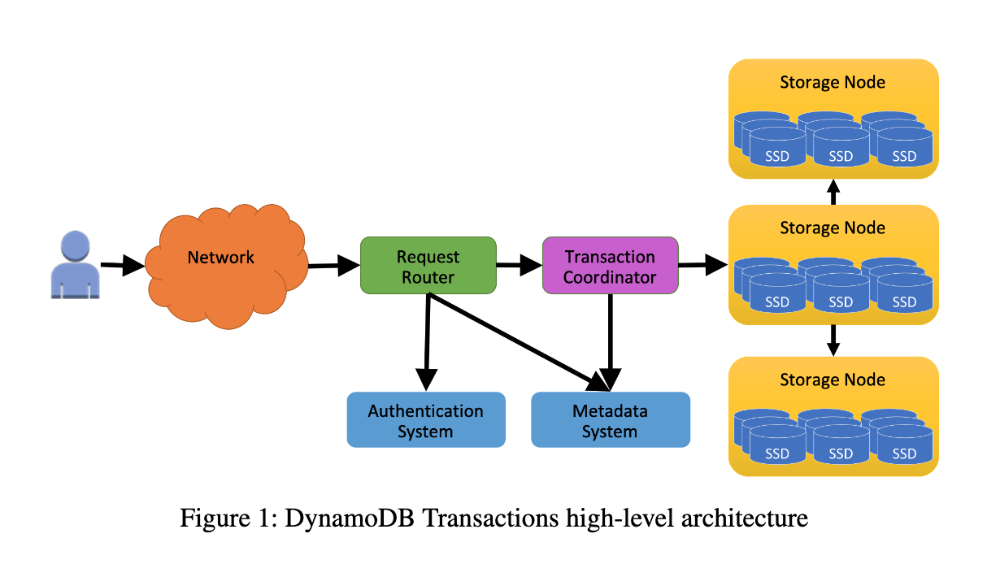

public:: true

- https://www.usenix.org/conference/atc23/presentation/idziorek
- tags:: databases, Papers We Love, AWS
- {:height 419, :width 712}
- id:: 64ca027c-700d-4f8d-904f-8b4468902cc3
  > Transactions are submitted as a single request.
- id:: 64ca01f6-1402-4196-98a9-7c5caead2abf
  > Transactions do not acquire locks.
- These two are possible due to the fact that transaction operations in DynamoDB are largely* deterministic in nature and are only submitted by transaction coordinators to storage nodes and not executed directly. The storage layer thus act as the serialization point in this workflow. It immediately rejects any transaction that submits an operation on an item already flagged for a write by an inflight transaction.
- > Once a timestamp has been assigned and preconditions checked, the storage nodes participating in the transaction can perform their portions of the transaction without
  coordination. Each storage node independently is responsible for ensuring that requests involving its items are executed in the proper order and for rejecting conflicting
  transactions that cannot be ordered properly.
- [[Papers We Love / Questions]] Does this mean storage layer partitions do not operate via single leaders? Considering operations can also be reordered by the storage layer, how does it make sure that all nodes in a partition arrive at the same "history"?
- > *Write transactions can be accepted even with an old timestamp.* If a write operation that is part of a transaction arrives at a storage node that has already performed a write (either an individual put or transactional put operation) with a later write timestamp, this transaction
  can still be accepted and enter the prepared state. If this transaction is committed, its write operation is ignored with the observation that, even if performed earlier, it
  would have been completely overwritten by the later put operation. This argument does not hold if the last write was a modify operation that partially updated the item’s contents. The benefit of accepting a transaction with an old timestamp, although it has no effect on some items being written, is that the transaction may contain write operations on other items that are allowed to complete.
  
  This particular key-value adaptation/optimization (one of a few listed in the paper) by DynamoDB of timestamp ordering sounds a bit weird to me. It seems like it requires keeping metadata (eg. is last write a partial update?) of recent transactions but at AWS scale doesn't a small window of these past transactions mean significant overhead storage/memory.
- > In the case where a transaction coordinator is incorrectly determined to have failed and
  its transaction reassigned, it is okay for multiple coordinators to be finishing the same transaction at the same time since duplicate attempts to write an item are ignored
  by its storage node.
  
  Same state keeping/checking apply here.
- On recovery / [[fault tolerance]]
  > If a storage node that is the primary for an item fails, then leadership will fail over to another storage node that is part of that item’s replication group. The metadata about transactions that had been accepted by the previous primary node is persistently stored and replicated within the group, and so is immediately available to the new primary...
  >
  > Transaction coordinator failures are of greater concern. Transaction coordinators can fail because of hardware or software issues. To ensure atomicity of transactions and that transactions complete in the face of failures, coordinators maintain a persistent record of each transaction and its outcome in a ledger. A recovery manager periodically scans the ledger looking for transactions that have not yet been completed (and for which a reasonable amount of time has passed since the transaction was received). Such stalled transactions are assigned to a new transaction coordinator who resumes executing the transaction protocol.
- The illustration of ledger use in transaction coordinators make the architecture of DynamoDB seem like a glorified (albeit distributed) job/work queue. That's probably a good thing and possibly even intentional. It's a well known pattern.
-